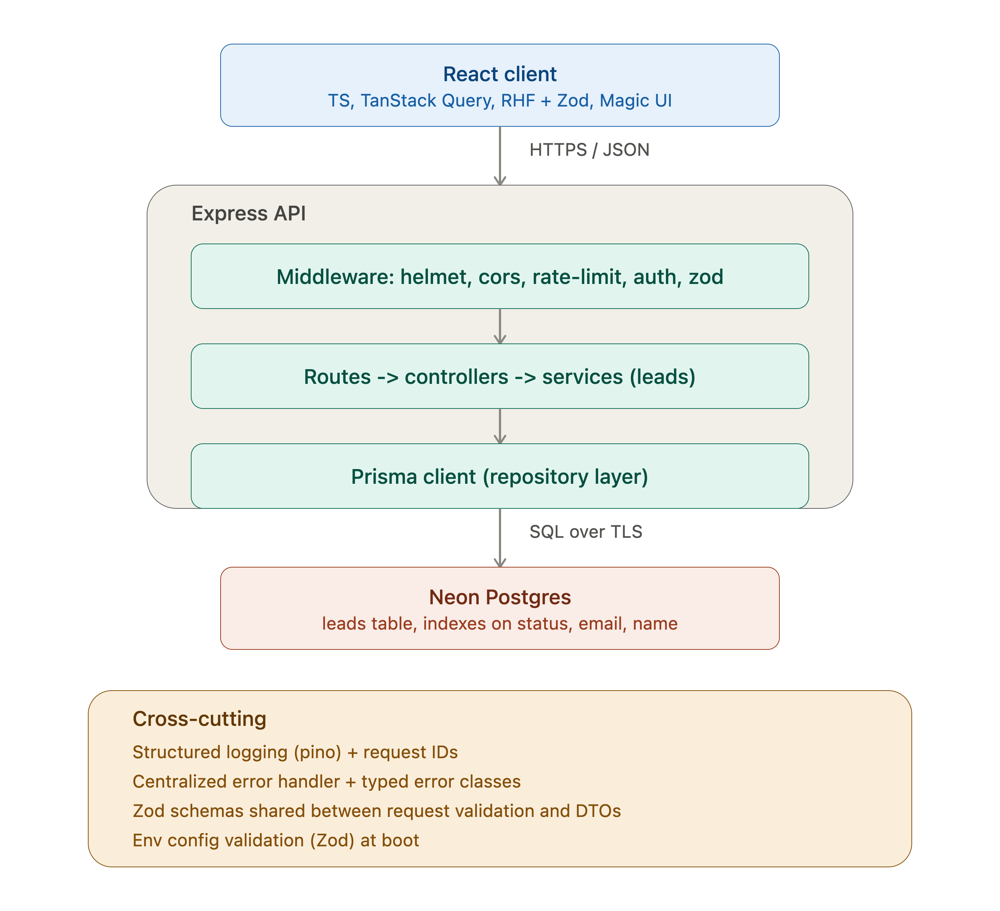

# lead-tracker-application

frontend 
1.created a react setup 
2. research for best archetecture for production where i can handle lead optimizly from frontend 


backend 
1. created a backend setup 
2. research for best archetecture for production where i can handle lead optimizly 
3. made prisma connection with neonDB postgres 
4. tested some init with basic query if database storing schemas with datas or not
5. made a health api check with modular code structure 
6. also added HTTP security with helmet 
7. adding cors for Access-Control-Allow-Origin
8. Structured logging
9. installing express-rate-limit for rate limiting
10. was had auth setup on previous project just used that auth code for this and fixed breaks from the AI so that will save time on this 

idead

┌──────────────────────────────┐
│          FRONTEND            │
│                              │
│ React + TypeScript           │
│ TanStack Query               │
│ React Hook Form              │
│ Zod                          │
└──────────────┬───────────────┘
               │
               │ HTTP / REST
               ▼
┌──────────────────────────────┐
│           BACKEND            │
│                              │
│ Node.js + TypeScript         │
│ Express                      │
│ Zod                          │
│ Prisma                       │
└──────────────┬───────────────┘
               │
               ▼
┌──────────────────────────────┐
│       Neon PostgreSQL        │
└──────────────────────────────┘





```
test account 
{
    "name" : "virender",
    "email" : "test123@gmail.com",
    "password" : "Test@123"
}
```